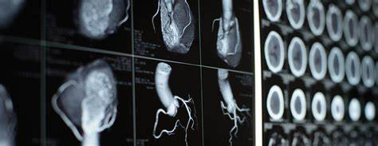

# Heart-Disease-Prediction-Model
In this project our model will predict output as a person have any heart disease or not and their accuracy level.  

 

# Tool Use
<h3> Pandas</h3>
 
<h3> Numpy</h3>
 
<h3> Jupyter </h3>
 

# Requriemnts/Libraries
<tr>
    <td>pip installPandas</td>
    <td>pip install numpy</td>
    <td>pip install sklearn</td>
    <td>pip install matplotlib</td>
    <td>pip install streamlit</td>
     <td>pip install pillow</td>
  </tr>
  #Run the Application
  <tr> streamlin run app.py </tr>
  

